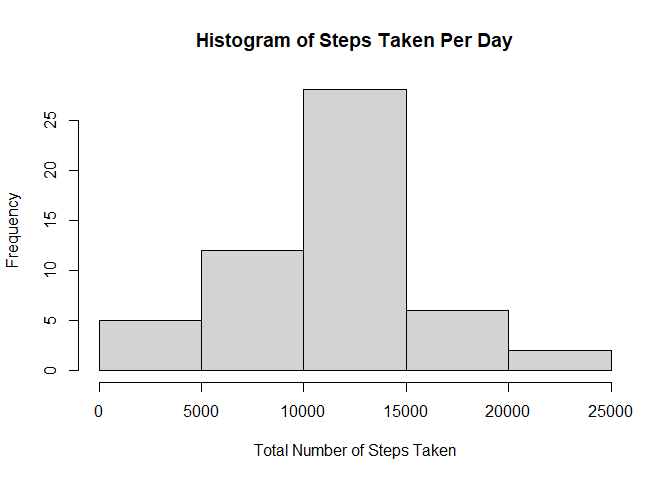
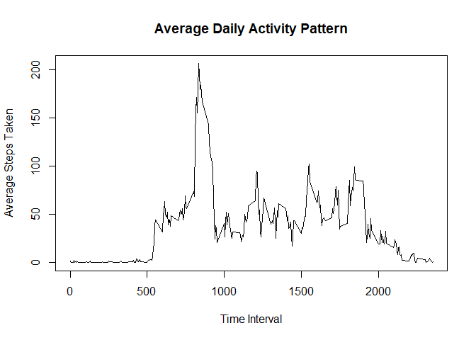
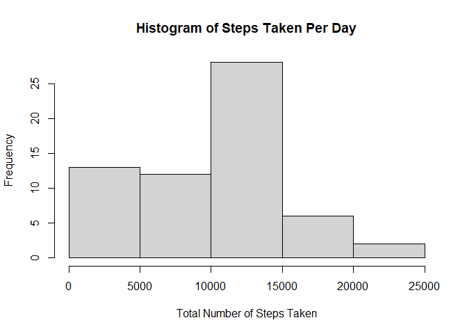
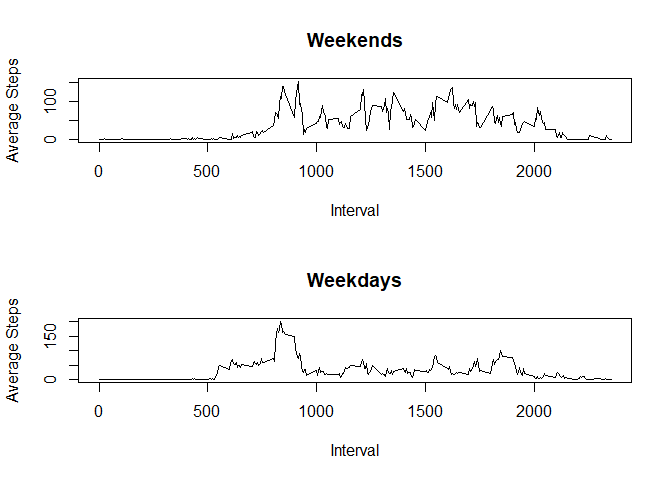

# Course Project 1

---------------------

## Data Preparation


```r
knitr::opts_chunk$set(fig.path='figs/')

#Load and read the data
data <- read.csv('activity.csv')

#Clean the data by removing all NA's
data <- na.omit(data)
```

## What is mean total number of steps taken per day?


```r
#Create an object that stores the total number of steps taken per day
steps_sum <- aggregate(data$steps, list(data$date), sum, simplify=TRUE)

#Plot the histogram for total number of steps taken
hist(steps_sum$x, main = "Histogram of Steps Taken Per Day", xlab = "Total Number of Steps Taken")
```

<!-- -->

```r
#Find the mean of the total number of steps
mean(steps_sum$x)
```

```
## [1] 10766.19
```

```r
#Find the median of the total number of steps
median(steps_sum$x)
```

```
## [1] 10765
```

## Average Daily Activity Pattern

```r
#Create object that has the average steps and interval
interval_steps <- aggregate(data$steps, list(data$interval), mean, simplify = TRUE)

#Plot the time series plot
plot(interval_steps$Group.1, interval_steps$x, type = "l", main = "Average Daily Activity Pattern", xlab = "Time Interval", ylab = "Average Steps Taken")
```

<!-- -->

```r
#Find which interval has max number of steps
int_index <- which.max(interval_steps$x)
print(interval_steps$Group.1[int_index])
```

```
## [1] 835
```
## Imputing Missing Values

```r
#Total number of missing values
data_raw <- read.csv('activity.csv')
length(which(is.na(data_raw)))
```

```
## [1] 2304
```

```r
#Replace all NA's with 0
data_raw[is.na(data_raw)] <- 0
data_new <- data_raw

#Repeat Part 1 but with the new data set
steps_sum_new <- aggregate(data_new$steps, list(data_new$date), sum, simplify=TRUE)

hist(steps_sum_new$x, main = "Histogram of Steps Taken Per Day", xlab = "Total Number of Steps Taken")
```

<!-- -->

```r
#The mean
mean(steps_sum_new$x)
```

```
## [1] 9354.23
```

```r
#The median
median(steps_sum_new$x)
```

```
## [1] 10395
```

**By imputing the data, the histogram has changed slightly with more emphasis of frequency on the far left.**

**The mean and median are both smaller as well.**

## Weekdays and Weekends

```r
library(chron)
```

```
## NOTE: The default cutoff when expanding a 2-digit year
## to a 4-digit year will change from 30 to 69 by Aug 2020
## (as for Date and POSIXct in base R.)
```

```r
#New factor variable created
data_raw$weekfactor <- is.weekend(data_new$date)

#Creating the data sets for weekend and weekday
weekday_data <- subset(data_raw, weekfactor == FALSE)
weekday_data <- aggregate(weekday_data$steps, list(weekday_data$interval), mean, simplify = TRUE)

weekend_data <- subset(data_raw, weekfactor == TRUE)
weekend_data <- aggregate(weekend_data$steps, list(weekend_data$interval), mean, simplify = TRUE)

#Plotting
par(mfrow = c(2, 1))
plot(weekend_data$Group.1, weekend_data$x, type = "l", main = "Weekends", xlab = "Interval", ylab = "Average Steps")
plot(weekday_data$Group.1, weekday_data$x, type = "l", main = "Weekdays", xlab = "Interval", ylab = "Average Steps")
```

<!-- -->
